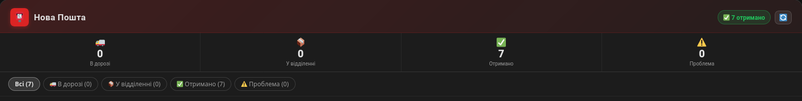

# 📮 Nova Poshta Card

[](https://github.com/hacs/integration)
[](https://github.com/igorolesko/lovelace-nova-poshta-card/releases)
[](LICENSE)

Lovelace картка для Home Assistant — трекінг посилок **Нової Пошти** в реальному часі.

> Потребує інтеграції [homeassistant-nova-poshta](https://github.com/igorolesko/homeassistant-nova-poshta)



---

## ✨ Можливості

- 🚚 4 статуси: В дорозі · У відділенні · Отримано · Потребує уваги
- 🎨 Кольорове підсвічування карток за статусом
- 🔍 Фільтрація посилок по статусу (клік на лічильник або кнопки фільтру)
- 📱 Адаптивна сітка: 2 колонки на desktop, 1 на mobile
- 🔄 Кнопка оновлення даних
- ⚙️ Нульова конфігурація — сенсори визначаються автоматично
- 🌙 Підтримка тем Home Assistant (dark / light)

---

## 📋 Що показує картка посилки

| Поле | Приклад |
|------|---------|
| ТТН | `20 4514 2485 3965` |
| Статус | ✅ Отримано |
| Опис | Кава |
| Маршрут | Тарасівка → Львів |
| Відправник | КУЗЬМЕНКО МИХАЙЛО ІЛЛІЧ ФОП |
| Відділення | Відділення №96: вул. Пасічна, 166 |
| Вага | 1.00 кг |
| Вартість доставки | 90 грн |
| Оголошена цінність | 200 грн |
| Заплановано | 28-04-2026 11:21:59 |
| Отримано | 28.04.2026 19:52:37 |
| Додатково | — |

---

## 🔧 Вимоги

- Home Assistant 2023.1+
- HACS (для автоматичного встановлення)
- Інтеграція [homeassistant-nova-poshta](https://github.com/igorolesko/homeassistant-nova-poshta)

---

## 📦 Встановлення

### Через HACS (рекомендовано)

1. HACS → **Custom repositories** → додай URL:
   ```
   https://github.com/igorolesko/lovelace-nova-poshta-card
   ```
   Тип: `Lovelace`

2. Знайди **Nova Poshta Card** → Встановити

3. Перезавантаж браузер (`Ctrl+Shift+R`)

### Вручну

1. Завантаж `nova-poshta-card.js`
2. Помісти у `/config/www/community/lovelace-nova-poshta-card/nova-poshta-card.js`
3. `Settings → Dashboards → Resources → Add`:
   ```
   URL:  /hacsfiles/lovelace-nova-poshta-card/nova-poshta-card.js
   Type: JavaScript module
   ```

---

## ⚙️ Конфігурація

Мінімальна (нульова конфігурація):
```yaml
type: custom:nova-poshta-card
```

З назвою:
```yaml
type: custom:nova-poshta-card
title: Нова Пошта
```

Картка **автоматично** знаходить усі сенсори `sensor.nova_poshta_*` —
вказувати номер телефону або entity ID не потрібно.

---

## 🗺️ Як це працює

Картка шукає серед усіх станів HA сенсори з префіксом `sensor.nova_poshta_`
і розподіляє їх за статусами по суфіксах:

| Суфікс сенсора | Статус |
|----------------|--------|
| `_v_dorozi` | 🚚 В дорозі |
| `_chekaie_u_viddilenni` | 📦 У відділенні |
| `_otrimano` | ✅ Отримано |
| `_potrebuie_uvagi` | ⚠️ Потребує уваги |

---

## 🤝 Пов'язані проекти

- [homeassistant-nova-poshta](https://github.com/igorolesko/homeassistant-nova-poshta) — інтеграція HA

---

## 📄 Ліцензія

MIT © [igorolesko](https://github.com/igorolesko/homeassistant-nova-poshta)
